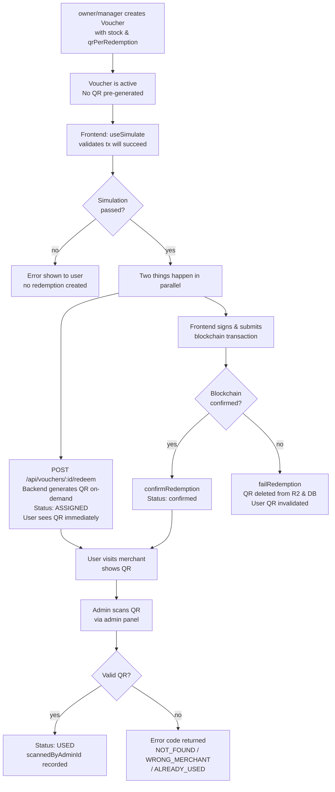

# Admin Role Restructure & QR Auto-Generation + Scan System

## Problem Frame

The current system has two admin roles (`owner`, `admin`) with no merchant-level scoping — all admins can see and manage all merchants. Additionally, QR codes must be manually prepared and uploaded as a ZIP by the admin, creating operational burden and potential for human error.

Two connected improvements are needed:

1. **Role restructure** — split the existing `admin` role into `manager` (platform-wide, like today's admin) and `admin` (merchant-specific, restricted to their own merchant). `owner` remains as the global superuser.
2. **QR system overhaul** — system generates QR codes automatically (eliminating the ZIP upload step); a new scan endpoint lets merchant admins validate physical voucher usage.

Affects: admin account management, voucher workflow, QR code lifecycle, and redemption flow.

---

## Participant & Role Overview

```
┌─────────────────────────────────────────────────────────┐
│                        owner                            │
│  Full platform control. Manages all accounts,           │
│  settings, merchants, and vouchers.                     │
└──────────────────────────┬──────────────────────────────┘
                           │ creates / manages / reassigns
           ┌───────────────┴────────────────┐
           ▼                                ▼
┌──────────────────┐             ┌─────────────────────────┐
│    manager       │             │         admin           │
│  Platform-wide.  │             │  Merchant-scoped.       │
│  Create/edit     │             │  Create vouchers &      │
│  merchants,      │             │  scan QR codes only     │
│  vouchers, QRs.  │             │  for their merchant.    │
│  No account mgmt │             │  Linked to 1 merchant   │
└──────────────────┘             └─────────────────────────┘
```

---

## Voucher & QR Lifecycle (New Flow)



---

## Requirements

### Role Structure

- R1. The `AdminRole` enum must support three values: `owner`, `manager`, `admin`. The existing `owner` and `admin` roles must be migrated — old `admin` becomes `manager`; a new `admin` role is introduced for merchant-scoped access.
- R2. `owner` has full platform control: manage accounts, merchants, vouchers, QR codes, fee settings, and app settings.
- R3. `manager` has the same access as today's `admin`: create and manage merchants, vouchers, QR codes, and view platform-wide analytics. Cannot manage accounts or app/fee settings.
- R4. `admin` (merchant-scoped) can only create/edit vouchers and scan QR codes for their linked merchant. Cannot access other merchants' data.
- R4a. `manager` and `owner` can scan QR codes from any merchant. The merchant context for the scan is derived from the QR token's associated voucher, not the caller's profile.
- R5. Only `owner` can create, deactivate, or delete admin accounts of any role.

### Account Management

- R6. When creating an `admin`-role account, a `merchantId` must be provided and stored. `merchantId` is not required (and should be null) for `owner` and `manager`.
- R7. One `admin` account is linked to exactly one merchant at a time. Only `owner` can change a merchant-scoped admin's `merchantId` assignment via the update endpoint.
- R7a. The admin update endpoint must support the following updatable fields by owner: `isActive` (any role), `merchantId` (only for `admin`-role accounts). Attempting to set `merchantId` on an `owner` or `manager` account must be rejected with a 400 error.
- R7b. An `admin` cannot change their own `merchantId`. Any `merchantId` field supplied by a non-owner in an update request must be rejected with a 403 error.
- R8. The default role for new accounts created via the API should be `manager` (replacing the old default of `admin`).
- R8a. The backend must provide complete account management endpoints for owner use: list all admins (with role and linked merchant info), create admin, update admin (`isActive`, `merchantId`), delete admin, and deactivate/reactivate admin. These are all existing endpoints with the updates described in R7a.

### Authentication & Session Security

- R9. On every authenticated request, after JWT verification, the backend must perform a database lookup to verify: (a) the admin record still exists, (b) `isActive` is true, (c) the stored `role` and `merchantId` match the token claims. If any check fails, return 401 immediately. This ensures deactivation and reassignment take effect instantly without waiting for token expiry.

### Permission Enforcement

- R10. All routes that are currently accessible to `admin` role must be updated to require `manager` or above. The new merchant-scoped `admin` role must not inherit blanket access to these routes.
- R11. For voucher creation, if the requester is a merchant-scoped `admin`, the `merchantId` on the voucher must be forced to their linked merchant — they cannot supply a different `merchantId`.
- R12. For voucher listing, QR code listing, and redemption listing, if the requester is a merchant-scoped `admin`, results must be filtered to their linked merchant only.
- R13. Analytics endpoints must return merchant-scoped data when accessed by an `admin` role, and platform-wide data when accessed by `owner` or `manager`.
- R14. Merchant management routes (create, edit, delete merchant) must require `manager` or `owner`. Merchant-scoped `admin` has no access to these routes.

### QR Auto-Generation

- R15. The admin ZIP upload endpoint (`POST /api/admin/vouchers/:id/upload-qr`) must be removed in the same release that auto-generation is shipped. No interim state where both mechanisms are absent is acceptable.
- R16. QR codes must be generated by the system automatically, on-demand, at the moment `initiateRedemption()` is called — triggered when the frontend calls `POST /api/vouchers/:id/redeem` after a successful `useSimulate`. QR codes are not pre-generated at voucher creation time.
- R17. The number of QR codes generated per redemption equals the voucher's `qrPerRedemption` value (1 or 2).
- R18. Each generated QR code must encode a unique, opaque token (cryptographically random, minimum 128 bits of entropy). The token must not be guessable from external information.
- R19. Generated QR images (PNG) must be uploaded to the existing Cloudflare R2 private bucket (`wealth-qr-codes`) and stored with the R2 key as `imageUrl`, consistent with the current QrCode schema.
- R20. The SHA256 hash of the generated QR image must be stored in `imageHash` (existing field).
- R21. On blockchain failure (`failRedemption()`), QR codes generated for that redemption must be deleted from R2 and their records removed from the database. The QR token becomes permanently invalid; any scan attempt after this will return `NOT_FOUND`.

### QR Scan & Physical Validation

- R22. A new endpoint must be added: `POST /api/admin/qr-codes/scan`. It accepts the decoded QR token value in the request body (`{ token: string }`).
- R23. The scan endpoint must enforce a rate limit of **60 requests per minute per adminId**. Requests exceeding this limit receive HTTP 429.
- R24. Scan validation must check, in order via a single DB query (QrCode joined with Voucher): (a) the token exists in the database, (b) the associated voucher belongs to the scanning admin's linked merchant (for `admin` role) or any merchant (for `owner`/`manager`), (c) QR status is `assigned`.
- R25. On successful scan, the QR status must be **atomically** updated to `used` using a conditional update (`WHERE status = 'assigned'`), `usedAt` set to the current timestamp, and `scannedByAdminId` set to the authenticated admin's ID. If the conditional update affects zero rows, return `ALREADY_USED`.
- R26. On failed scan, the endpoint must return a clear error code: `NOT_FOUND`, `WRONG_MERCHANT`, or `ALREADY_USED`.
- R27. The scan endpoint must be protected by `requireAdmin` (any role). Merchant-scoped `admin` can only scan QR codes belonging to their own linked merchant (enforced server-side per R24b).
- R28. The QR scan step is independent of the blockchain confirmation step. Blockchain confirmation sets redemption status to confirmed (user paid). Admin scan sets QR status to `used` (voucher physically redeemed at merchant). These are two distinct events.

### QR Code Lifecycle (Updated)

- R29. The active QR status lifecycle is: `assigned` → `used`.
  - `assigned`: System generated QR at redemption initiation and linked it to a user.
  - `used`: Admin scanned — voucher physically redeemed at merchant.
  - Note: The `available` status value is retained in the schema for legacy records from the old ZIP upload flow. No newly auto-generated QR will ever enter `available` state.
- R30. The existing `POST /api/admin/qr-codes/:id/mark-used` endpoint must be removed in the same release that the scan endpoint is shipped. The scan endpoint is the sole mechanism for transitioning QR status to `used`.

---

## Success Criteria

- An `admin`-role account can create a voucher only for their linked merchant; attempting to create one for another merchant is rejected.
- An `admin`-role account scanning a QR code from a different merchant receives a `WRONG_MERCHANT` error.
- After `initiateRedemption()`, QR images are present in R2 and their records show status `assigned` — with no manual upload step required.
- After a merchant admin scans a valid QR, its status becomes `used` and cannot be scanned again (concurrent duplicate scans receive `ALREADY_USED`).
- Deactivating an admin account takes effect immediately — subsequent requests with their existing JWT are rejected (R9).
- Owner can reassign an `admin`-role account to a different merchant via the update endpoint.
- `owner` and `manager` accounts retain full access to all existing functionality.
- No QR images are pre-generated in bulk at voucher creation time.

---

## Scope Boundaries

- **Out of scope:** Frontend admin panel changes (scan UI, role-based navigation). This document covers backend API only.
- **Out of scope:** Multi-merchant assignment for a single `admin` account. One admin → one merchant at a time.
- **Out of scope:** Merchant self-registration or merchant-initiated account creation. Account management remains owner-only.
- **Out of scope:** QR code expiry or time-limited tokens. QR codes do not expire.
- **Out of scope:** Offline/fallback scan verification (no internet = no scan). API availability is assumed.

---

## Key Decisions

- **QR generation at initiation (not confirmation):** Frontend uses `useSimulate` (wagmi) to validate the transaction before submission. If simulation passes, the frontend calls `initiateRedemption` and submits the blockchain tx in parallel — the user sees the QR immediately without waiting for on-chain confirmation. If the blockchain eventually fails, `failRedemption()` deletes the QR and it becomes permanently invalid at scan time.
- **Scan = physical usage, blockchain = payment:** Two independent events tracked separately.
- **DB check on every authenticated request:** After JWT verification, the backend re-fetches the admin record to assert `isActive`, `role`, and `merchantId` match. Ensures deactivation and reassignment are instant.
- **Owner-managed merchant reassignment:** `merchantId` on an `admin` account is mutable by `owner` only. Admins cannot self-reassign.
- **Role rename:** Old `admin` → `manager` in the enum. New `admin` is the restricted merchant-scoped role. Breaking change requiring a data migration for all existing rows.
- **QR token format:** Cryptographically random opaque identifier (minimum 128 bits entropy). Exact format deferred to planning.
- **Atomic swaps:** ZIP upload endpoint and `mark-used` endpoint are each removed in the same release that their replacements ship.
- **Rate limiting on scan:** 60 requests per minute per adminId, keyed on authenticated identity (not IP).

---

## Dependencies / Assumptions

- Cloudflare R2 infrastructure (`wealth-qr-codes` bucket, upload/delete helpers in `src/services/r2.ts`) remains unchanged.
- QR image generation will use an npm library (e.g., `qrcode`); selection deferred to planning.
- **Schema additions required:**
  - `Admin` model: add `merchantId String? @map("merchant_id")` with FK to `Merchant`.
  - `QrCode` model: add `token String @unique` (opaque verification value, scan lookup key).
  - `QrCode` model: add `scannedByAdminId String? @map("scanned_by_admin_id")` with FK to `Admin`.
- **Data migration required:** All existing `admin`-role rows in `admins` table must be updated to `manager` before the new schema deploys. The Prisma migration must include `UPDATE admins SET role = 'manager' WHERE role = 'admin'` executed atomically with the enum change.
- **AdminAuth type update required:** `src/middleware/auth.ts` `AdminAuth.role` must be updated to `'owner' | 'manager' | 'admin'` and include `merchantId?: string`. The `requireAdmin` middleware must perform a DB lookup on every request (R9).
- **`ADMIN_JWT_SECRET` must not fall back to a hardcoded default.** The `|| 'change-me'` fallback in `src/middleware/auth.ts` must be removed; startup must fail fast if the secret is absent.
- Vouchers already have a `merchantId` field in the current schema. Planning should verify no nulls exist before implementing merchant-scoped filtering.
- `initiateRedemption()` in `src/services/redemption.ts` currently pre-assigns QR codes from an existing pool — this block must be replaced with on-demand QR generation.
- `failRedemption()` currently resets QR codes to `available` — this must be replaced with R2 deletion and DB record removal (R21).

---

## Outstanding Questions

### Resolve Before Planning

- *(none)*

### Deferred to Planning

- [Affects R18][Technical] Exact token format: recommend `crypto.randomBytes(16).toString('hex')` (128-bit hex). Decide whether to store raw token or SHA256(token) in DB — storing the hash protects against DB dump attacks at the cost of one extra hash on scan.
- [Affects R16, R21][Technical] Verify transaction boundary in `initiateRedemption()`: generate QR in memory → upload to R2 → DB transaction (create QrCode records + pending Redemption). On DB rollback, issue compensating R2 deletes synchronously.
- [Affects R1][Needs research] PostgreSQL enum rename (`admin` → `manager`) in Prisma requires multi-step migration. Verify approach: `ALTER TYPE "AdminRole" ADD VALUE 'manager'`, data migration, then remove old value via type replacement.
- [Affects R22][Technical] Single Prisma query for scan: `prisma.qrCode.findUnique({ where: { token }, include: { voucher: { select: { merchantId: true } } } })`. Confirm this covers all validation steps in R24.
- [Affects R13][Technical] Add optional `merchantId` parameter to each analytics service function in `src/services/analytics.ts` (`getSummaryStats`, `getRedemptionsOverTime`, `getWealthVolumeOverTime`, `getTopMerchants`, `getTopVouchers`, `getMerchantCategoryDistribution`). Pass `adminAuth.merchantId` when role is `admin`, otherwise `undefined`.

## Next Steps

→ `/ce:plan` for structured implementation planning
