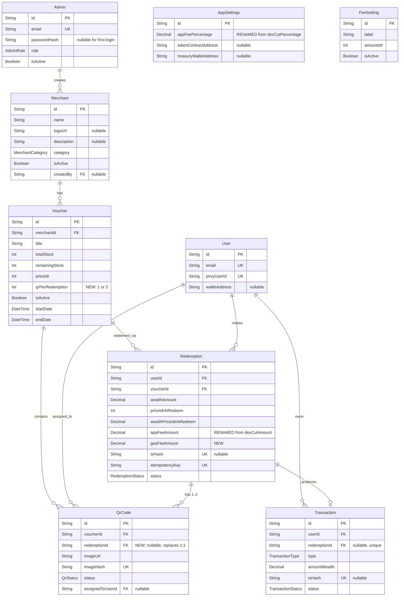

# TDD Comprehensive Test Suite & Backend Hardening

## Overview

Implement a full test suite for the WEALTH redemption backend using **Test-Driven Development (TDD)** methodology across **8 phases**. Each phase follows the Red-Green-Refactor cycle: write failing tests first, implement the minimum code to pass, then refactor. This plan covers all back-office (admin) and app (user) functionality, schema migrations, security hardening, and validation — ensuring the backend functions optimally with strong security.

**Tech Stack:** Hono 4.7 + Prisma 7.7 + PostgreSQL + Vitest + Zod 4 + TypeScript

## Problem Statement / Motivation

The current backend has:
- **Zero test coverage** — no test framework installed, no test files
- **No input validation** — all routes use raw `c.req.json()` without Zod schemas
- **No rate limiting** — auth endpoints vulnerable to brute force
- **Critical security gaps** — webhook signature unverified, JWT claims not re-validated against DB, client-supplied price trusted blindly
- **Missing features from brainstorm** — multi-QR, 3-component pricing, first-login flow, FeeSetting model, CoinGecko integration (see brainstorm: `docs/brainstorms/2026-04-12-backend-overhaul-brainstorm.md`)

## Proposed Solution

A phased TDD approach where each phase:
1. Writes failing tests first (Red)
2. Implements minimum code to pass (Green)
3. Refactors for clarity (Refactor)
4. Verifies all tests pass before moving to next phase

## Technical Approach

### Architecture Changes

**Critical prerequisite — Separate app from server (see brainstorm: testability requirement):**

```
src/app.ts    ← NEW: exports Hono app (no server start)
src/index.ts  ← REDUCED: imports app, starts server only
```

**New file structure:**

```
tests/
  global-setup.ts                 # Testcontainers PostgreSQL lifecycle
  setup.integration.ts            # Prisma transaction-wrapped client
  helpers/
    auth.ts                       # createTestAdminToken, createTestUserToken
    fixtures.ts                   # Factory functions for test data
    request.ts                    # Helper to build app.request() calls
  unit/
    schemas/                      # Zod schema validation tests
    services/                     # Business logic tests
    middleware/                    # Auth middleware tests
  integration/
    routes/                       # Public route tests
    routes/admin/                 # Admin route tests
  e2e/                            # Full workflow tests
```

### ERD — Post-Migration Schema



---

## Implementation Phases

### Phase 1: Test Infrastructure & Foundation

**Goal:** Set up Vitest, Testcontainers, test helpers, and the app/server separation — the foundation everything else builds on.

**TDD Note:** This phase is infrastructure-only. We write a smoke test to verify the setup works.

#### 1.1 Install Dependencies

**File: `package.json`**

```bash
pnpm add -D vitest @vitest/coverage-v8 vitest-mock-extended \
  testcontainers @testcontainers/postgresql
```

Add scripts:
```json
{
  "test": "vitest",
  "test:unit": "vitest run --project unit",
  "test:integration": "vitest run --project integration",
  "test:coverage": "vitest run --coverage",
  "test:watch": "vitest --watch"
}
```

#### 1.2 Separate App from Server

**File: `src/app.ts` (NEW)**
- Move all Hono app setup, middleware, and route mounting from `src/index.ts`
- Export the `app` instance as default export
- Do NOT call `serve()` here

**File: `src/index.ts` (MODIFIED)**
- Import `app` from `./app.js`
- Only call `serve()` and `console.log`

#### 1.3 Vitest Configuration

**File: `vitest.config.ts` (NEW)**
- Multi-project config: `unit` (mocked Prisma) and `integration` (Testcontainers)
- Path alias: `@` → `./src`
- Coverage thresholds: 80% statements, 75% branches, 80% functions, 80% lines
- Test env variables: `ADMIN_JWT_SECRET=test-secret-min-32-chars-for-vitest`

#### 1.4 Test Helpers

**File: `tests/helpers/auth.ts` (NEW)**
- `createTestAdminToken(overrides?)` — generates valid admin JWT for tests
- `createExpiredAdminToken()` — generates expired token
- `createTokenWithWrongSecret()` — generates token with wrong signing key

**File: `tests/helpers/fixtures.ts` (NEW)**
- `createAdmin(overrides?)` — factory for admin records
- `createUser(overrides?)` — factory for user records
- `createMerchant(adminId, overrides?)` — factory for merchant records
- `createVoucherWithQrCodes(merchantId, qrCount, overrides?)` — factory for voucher + QR codes
- `createAppSettings(overrides?)` — factory for singleton settings

**File: `tests/helpers/request.ts` (NEW)**
- `jsonPost(path, body, token?)` — helper for POST requests with JSON body
- `jsonPut(path, body, token?)` — helper for PUT requests
- `authGet(path, token)` — helper for authenticated GET

#### 1.5 Testcontainers Global Setup

**File: `tests/global-setup.ts` (NEW)**
- Start PostgreSQL 16 container
- Run `prisma migrate deploy`
- Seed base data
- Export `DATABASE_URL` to env

**File: `tests/setup.integration.ts` (NEW)**
- Mock `@/db.js` with test database Prisma client
- Transaction cleanup between tests

#### 1.6 Prisma Mock Setup

**File: `tests/mocks/prisma.ts` (NEW)**
- Deep mock of PrismaClient using `vitest-mock-extended`
- Auto-reset between tests

#### 1.7 Smoke Test (Verification)

**File: `tests/integration/routes/health.test.ts` (NEW)**

```typescript
// RED: Write test first
describe("Health Check", () => {
  test("GET /api/health returns status ok", async () => {
    const res = await app.request("/api/health");
    expect(res.status).toBe(200);
    const body = await res.json();
    expect(body.status).toBe("ok");
    expect(body.timestamp).toBeDefined();
  });
});
```

**Verification Checklist:**
- [ ] `pnpm test:unit` runs successfully (smoke test passes)
- [ ] `pnpm test:integration` runs successfully (health check passes against real DB)
- [ ] `pnpm test:coverage` generates report
- [ ] App starts normally with `pnpm dev` (server separation didn't break anything)

---

### Phase 2: Schema Migration & Model Validation

**Goal:** Apply all schema changes from brainstorm, write tests that verify the new schema structure. (see brainstorm: Schema Changes Required)

#### 2.1 Write Migration Tests First (RED)

**File: `tests/integration/schema/migration.test.ts` (NEW)**

Tests that verify the new schema:
- [ ] Admin can be created with `passwordHash: null`
- [ ] Voucher has `qrPerRedemption` field with default `1`
- [ ] QrCode has `redemptionId` nullable FK
- [ ] Redemption no longer has `qrCodeId` (one-to-many via QrCode)
- [ ] AppSettings field is `appFeePercentage` (not devCutPercentage)
- [ ] Redemption has `appFeeAmount` and `gasFeeAmount` fields
- [ ] FeeSetting model exists with `label`, `amountIdr`, `isActive`
- [ ] Only one FeeSetting can be active at a time (application-level constraint)

#### 2.2 Apply Prisma Migrations (GREEN)

**File: `prisma/schema.prisma` (MODIFIED)**

Changes per brainstorm:

| Model | Change |
|-------|--------|
| `Admin` | `passwordHash String?` (nullable) |
| `Voucher` | Add `qrPerRedemption Int @default(1)` |
| `QrCode` | Add `redemptionId String? FK` to Redemption |
| `QrCode` | Remove `redemption Redemption?` (1:1) → `redemption Redemption? @relation(...)` via redemptionId |
| `Redemption` | Remove `qrCodeId String @unique` |
| `Redemption` | Add `qrCodes QrCode[]` (one-to-many) |
| `Redemption` | Rename `devCutAmount` → `appFeeAmount` |
| `Redemption` | Add `gasFeeAmount Decimal @db.Decimal(36, 18)` |
| `AppSettings` | Rename `devCutPercentage` → `appFeePercentage` |
| `FeeSetting` | NEW model: `id`, `label`, `amountIdr Int`, `isActive Boolean @default(false)`, timestamps |

Run migration:
```bash
pnpm db:migrate -- --name multi-qr-pricing-fees
```

#### 2.3 Update Seed File

**File: `prisma/seed.ts` (MODIFIED)**
- Update `devCutPercentage` → `appFeePercentage`
- Add default FeeSetting record

#### 2.4 Update Existing Code to Match Schema (REFACTOR)

Files that reference old schema fields and need updating:
- `src/services/redemption.ts` — remove `qrCodeId`, use `qrCodes` relation, add `gasFeeAmount`
- `src/routes/redemptions.ts` — change `qrCode: true` to `qrCodes: true`
- `src/routes/admin/redemptions.ts` — same
- `src/routes/admin/settings.ts` — rename field references
- `src/services/analytics.ts` — no change needed

**Verification Checklist:**
- [ ] All Phase 2 migration tests pass
- [ ] `pnpm db:migrate` succeeds
- [ ] `pnpm db:seed` succeeds
- [ ] Existing Phase 1 tests still pass

---

### Phase 3: Zod Validation Schemas & Input Security

**Goal:** Create Zod schemas for every endpoint's request body and query params. Write tests for each schema (positive, negative, edge cases) FIRST, then implement.

#### 3.1 Define Zod Schemas (Tests First)

**File: `src/schemas/auth.ts` (NEW)**

Schemas:
- `loginSchema` — `{email: z.string().email(), password: z.string().min(8)}`
- `setPasswordSchema` — `{email: z.string().email(), password: z.string().min(8).max(128), confirmPassword}` with `.refine()` for match

**File: `tests/unit/schemas/auth.test.ts` (NEW)**
- [ ] Valid login data passes
- [ ] Missing email fails
- [ ] Invalid email format fails
- [ ] Password < 8 chars fails
- [ ] Password > 128 chars fails
- [ ] Extra fields stripped (`.strict()` or `.strip()`)

**File: `src/schemas/merchant.ts` (NEW)**

Schemas:
- `createMerchantSchema` — `{name: z.string().min(2).max(200), description: z.string().max(2000).optional(), category: z.enum([...MerchantCategory]), logoUrl: z.string().url().optional()}`
- `updateMerchantSchema` — same but all optional
- `merchantQuerySchema` — `{category: z.enum().optional(), search: z.string().max(100).optional(), page: z.coerce.number().int().min(1).default(1), limit: z.coerce.number().int().min(1).max(100).default(20)}`

**File: `tests/unit/schemas/merchant.test.ts` (NEW)**
- [ ] Valid merchant data passes
- [ ] Name too short/long fails
- [ ] Invalid category enum fails
- [ ] Invalid URL format for logoUrl fails
- [ ] XSS in name is sanitized/rejected
- [ ] Query: page=0 rejected, page=-1 rejected, limit=101 rejected
- [ ] Query: page=NaN → defaults to 1

**File: `src/schemas/voucher.ts` (NEW)**

Schemas:
- `createVoucherSchema` — merchantId (UUID), title, description, startDate, endDate, totalStock (positive int), priceIdr (min 1000), qrPerRedemption (1 or 2)
- `updateVoucherSchema` — all optional except qrPerRedemption (immutable after creation)
- `redeemVoucherSchema` — `{idempotencyKey: z.string().uuid(), wealthPriceIdr: z.number().positive()}`

**File: `tests/unit/schemas/voucher.test.ts` (NEW)**
- [ ] Valid voucher data passes
- [ ] endDate before startDate fails (custom refinement)
- [ ] Negative totalStock fails
- [ ] priceIdr < 1000 fails
- [ ] qrPerRedemption = 0 or 3 fails (must be 1 or 2)
- [ ] Non-UUID merchantId fails
- [ ] Redeem: wealthPriceIdr = 0 fails, negative fails

**File: `src/schemas/qr-code.ts` (NEW)**

Schemas:
- `createQrCodeSchema` — `{voucherId: UUID, imageUrl: URL, imageHash: string}`
- `qrCodeQuerySchema` — voucherId, status enum, pagination

**File: `tests/unit/schemas/qr-code.test.ts` (NEW)**
- [ ] Valid QR data passes
- [ ] Non-UUID voucherId fails
- [ ] Invalid URL for imageUrl fails
- [ ] Empty imageHash fails

**File: `src/schemas/admin.ts` (NEW)**

Schemas:
- `createAdminSchema` — `{email, password (min 8), role: z.enum(["admin", "owner"]).default("admin")}`
- `updateAdminSchema` — `{isActive: z.boolean()}`

**File: `tests/unit/schemas/admin.test.ts` (NEW)**
- [ ] Valid admin data passes
- [ ] Invalid role enum fails
- [ ] Weak password fails

**File: `src/schemas/fee-setting.ts` (NEW)**

Schemas:
- `createFeeSettingSchema` — `{label: z.string().min(2).max(100), amountIdr: z.number().int().min(0)}`
- `updateFeeSettingSchema` — same but optional

**File: `tests/unit/schemas/fee-setting.test.ts` (NEW)**
- [ ] Valid fee data passes
- [ ] Negative amountIdr fails
- [ ] Empty label fails

**File: `src/schemas/settings.ts` (NEW)**

Schemas:
- `updateSettingsSchema` — `{appFeePercentage: z.number().min(0).max(100).optional(), tokenContractAddress: z.string().optional(), treasuryWalletAddress: z.string().optional()}`

**File: `tests/unit/schemas/settings.test.ts` (NEW)**
- [ ] Valid settings pass
- [ ] appFeePercentage > 100 fails
- [ ] appFeePercentage negative fails

**File: `src/schemas/common.ts` (NEW)**

Shared schemas:
- `paginationSchema` — `{page: z.coerce.number().int().min(1).default(1), limit: z.coerce.number().int().min(1).max(100).default(20)}`
- `uuidParamSchema` — `{id: z.string().uuid()}`

**File: `tests/unit/schemas/common.test.ts` (NEW)**
- [ ] Valid pagination passes
- [ ] page=0 fails, limit=0 fails
- [ ] Non-UUID id fails

#### 3.2 Wire Zod Schemas into Route Handlers (GREEN)

Apply Zod validation to all route handlers using Hono's `zValidator` from `@hono/zod-validator` or manual `schema.safeParse()` with consistent error response format:

```typescript
// Pattern for all routes:
const parsed = schema.safeParse(data);
if (!parsed.success) {
  return c.json({ error: "Validation failed", details: parsed.error.flatten() }, 400);
}
```

Files to modify:
- `src/routes/auth.ts` — login, set-password
- `src/routes/merchants.ts` — query params
- `src/routes/vouchers.ts` — query params, redeem body
- `src/routes/admin/merchants.ts` — create, update body
- `src/routes/admin/vouchers.ts` — create, update body
- `src/routes/admin/qr-codes.ts` — create body
- `src/routes/admin/admins.ts` — create, update body
- `src/routes/admin/settings.ts` — update body
- `src/routes/webhook.ts` — webhook payload

Install: `pnpm add @hono/zod-validator`

**Verification Checklist:**
- [ ] All Zod schema unit tests pass (50+ test cases)
- [ ] All route handlers use Zod validation
- [ ] Invalid input returns 400 with structured error details
- [ ] Phase 1 & 2 tests still pass

---

### Phase 4: Auth, Security & Middleware Tests

**Goal:** Test all auth flows, implement first-login password flow, add rate limiting, and harden JWT validation.

#### 4.1 Auth Middleware Tests (RED → GREEN)

**File: `tests/unit/middleware/auth.test.ts` (NEW)**

`requireAdmin`:
- [ ] Returns 401 without Authorization header
- [ ] Returns 401 with non-Bearer prefix
- [ ] Returns 401 with expired token
- [ ] Returns 401 with token signed by wrong secret
- [ ] Returns 401 with malformed token
- [ ] Returns 200 and sets `adminAuth` context with valid token
- [ ] Sets correct `role` (admin vs owner) from JWT claims

`requireOwner`:
- [ ] Returns 403 when admin role is "admin" (not owner)
- [ ] Passes through when admin role is "owner"
- [ ] Returns 403 when adminAuth is not set

`requireUser` (needs Privy mock):
- [ ] Returns 401 without Authorization header
- [ ] Returns 401 with invalid Privy token
- [ ] Returns 404 when Privy user not in database
- [ ] Returns 200 and sets `userAuth` context with valid token and DB user

#### 4.2 Admin Login Tests (RED → GREEN)

**File: `tests/integration/routes/auth.test.ts` (NEW)**

`POST /api/auth/login`:
- [ ] Returns 200 + JWT token for valid credentials
- [ ] Returns 401 for wrong password (does NOT reveal if email exists)
- [ ] Returns 401 for inactive admin (same error message as wrong password)
- [ ] Returns 401 for non-existent email
- [ ] Returns 400 for missing email
- [ ] Returns 400 for missing password
- [ ] Returns 400 for empty string email/password
- [ ] JWT token contains correct `id`, `email`, `role` claims
- [ ] JWT token expires in 24h

`GET /api/auth/me`:
- [ ] Returns 401 without token
- [ ] Returns admin context with valid token

#### 4.3 First-Login Password Flow (RED → GREEN) — NEW

(see brainstorm: First-Login Password Flow — nullable passwordHash, set-password endpoint)

**File: `tests/integration/routes/auth-set-password.test.ts` (NEW)**

`POST /api/auth/set-password`:
- [ ] Returns 200 when admin has null passwordHash, sets new password
- [ ] Returns 400 if password < 8 chars
- [ ] Returns 400 if password !== confirmPassword
- [ ] Returns 409 if admin already has a passwordHash (cannot re-set)
- [ ] After set-password, admin can login with new password via POST /login
- [ ] Returns 401 for non-existent admin email
- [ ] Returns 400 for missing fields

**Implementation:** `POST /api/auth/set-password` — Allows admin with null passwordHash to set their password. Uses email as identifier since the admin cannot log in yet. No auth required, but rate-limited.

**File: `src/routes/auth.ts` (MODIFIED)** — Add set-password endpoint

#### 4.4 User Sync Tests (RED → GREEN)

**File: `tests/integration/routes/auth-user-sync.test.ts` (NEW)**

`POST /api/auth/user-sync`:
- [ ] Creates new user from Privy token (first sync)
- [ ] Updates existing user (repeat sync — email/wallet change)
- [ ] Returns 401 for invalid Privy token
- [ ] Returns 401 without Authorization header
- [ ] Returns 400 when Privy user has no email

#### 4.5 Rate Limiting (RED → GREEN)

**File: `src/middleware/rate-limit.ts` (NEW)**

Custom rate limiter middleware using in-memory Map store:
- `loginLimiter` — 5 attempts per email per 15 minutes
- `setPasswordLimiter` — 3 attempts per email per 15 minutes
- `userSyncLimiter` — 10 requests per IP per minute

**File: `tests/unit/middleware/rate-limit.test.ts` (NEW)**
- [ ] Allows requests under limit
- [ ] Returns 429 when limit exceeded
- [ ] Includes `Retry-After` header
- [ ] Resets after window expires
- [ ] Rate limits per key (IP or email), not globally

#### 4.6 JWT Re-validation Against Database

**File: `src/middleware/auth.ts` (MODIFIED)**

Enhancement: `requireAdmin` should check that the admin still exists and is active in the database (not just trust JWT claims). Cache the check for 5 minutes to avoid DB hit on every request.

**File: `tests/integration/middleware/auth-revalidation.test.ts` (NEW)**
- [ ] Deactivated admin with valid JWT gets 401
- [ ] Deleted admin with valid JWT gets 401
- [ ] Role change in DB is reflected (within cache TTL)

**Verification Checklist:**
- [ ] All auth tests pass (30+ test cases)
- [ ] Rate limiting works on login, set-password, user-sync
- [ ] First-login flow works end-to-end: create admin (no password) → set-password → login
- [ ] Deactivated admin cannot access endpoints even with valid JWT
- [ ] All Phase 1-3 tests still pass

---

### Phase 5: Core Business Logic Tests

**Goal:** Test redemption service with multi-QR support, 3-component pricing, CoinGecko price service, and analytics — all with TDD.

#### 5.1 Price Service (RED → GREEN)

**File: `tests/unit/services/price.test.ts` (NEW)**

CoinGecko integration:
- [ ] Returns fresh price on cache miss (calls CoinGecko API)
- [ ] Returns cached price on cache hit (no API call)
- [ ] Returns stale cache when API fails
- [ ] Returns 500 when API fails and no cache
- [ ] Respects CACHE_TTL (60 seconds)
- [ ] Handles malformed CoinGecko response gracefully
- [ ] Handles network timeout gracefully

**File: `src/services/price.ts` (NEW)** — Extract price logic from route into service

**File: `src/routes/price.ts` (MODIFIED)** — Use price service

#### 5.2 Fee Setting Service (RED → GREEN)

**File: `tests/unit/services/fee-setting.test.ts` (NEW)**

- [ ] `getActiveFee()` returns the single active fee setting
- [ ] `getActiveFee()` returns null when no fee is active
- [ ] `activateFee(id)` sets the given fee to active and deactivates all others (transaction)
- [ ] `deactivateFee(id)` sets isActive to false

#### 5.3 3-Component Pricing Calculation (RED → GREEN)

(see brainstorm: 3-Component Pricing — Base Price + App Fee (3%) + Gas Fee (fixed IDR))

**File: `tests/unit/services/pricing.test.ts` (NEW)**

Formula: `totalIdr = priceIdr + (priceIdr * appFeePercentage / 100) + gasFeeIdr`
Then: `wealthAmount = totalIdr / wealthPriceIdr`

Test cases:
- [ ] Standard calculation: priceIdr=25000, appFee=3%, gasFee=5000, wealthPrice=850 → correct amounts
- [ ] Zero gas fee (no active FeeSetting): totalIdr = priceIdr + appFee only
- [ ] Large values don't overflow (Decimal precision)
- [ ] Very small wealthPriceIdr (large WEALTH amount) — uses Decimal properly
- [ ] AppFeeAmount calculated correctly: `(priceIdr * appFeePercentage / 100) / wealthPriceIdr`
- [ ] GasFeeAmount calculated correctly: `gasFeeIdr / wealthPriceIdr`
- [ ] All amounts stored as Decimal(36, 18)

**File: `src/services/pricing.ts` (NEW)** — Pure function for price calculation

#### 5.4 Redemption Service — Initiate (RED → GREEN)

**File: `tests/unit/services/redemption-initiate.test.ts` (NEW)**

Happy path:
- [ ] Creates redemption with status=pending for valid voucher
- [ ] Assigns 1 QR code when `qrPerRedemption=1`
- [ ] Assigns 2 QR codes when `qrPerRedemption=2`
- [ ] QR codes set to status=assigned
- [ ] Calculates wealthAmount using 3-component pricing
- [ ] Returns `alreadyExists: true` for duplicate idempotency key

Error cases:
- [ ] Throws "Voucher not found" for non-existent voucherId
- [ ] Throws "Voucher is not active" for inactive voucher
- [ ] Throws "Voucher out of stock" when remainingStock=0
- [ ] Throws "Voucher expired" when endDate < now
- [ ] Throws "No QR codes available" when no available QR codes
- [ ] Throws "Not enough QR codes available" when qrPerRedemption=2 but only 1 QR available

Edge cases:
- [ ] Idempotency key scoped to user (User B's key doesn't return User A's redemption)
- [ ] wealthPriceIdr validated against server price (5% tolerance)
- [ ] Concurrent redemptions: row-level locking ensures one wins, other gets proper error

**File: `src/services/redemption.ts` (MODIFIED)**
- Remove `qrCodeId`, use QrCode.redemptionId
- Support multi-QR (1 or 2 per voucher's qrPerRedemption)
- Use 3-component pricing
- Validate wealthPriceIdr against server price
- Scope idempotency key to user

#### 5.5 Redemption Service — Confirm (RED → GREEN)

**File: `tests/unit/services/redemption-confirm.test.ts` (NEW)**

- [ ] Confirms pending redemption: status → confirmed, confirmedAt set
- [ ] Decrements voucher stock by 1
- [ ] Creates transaction ledger entry with correct amounts
- [ ] QR code(s) status remains assigned (not changed to used — merchant marks used)
- [ ] Throws "Redemption not found" for unknown txHash
- [ ] Does nothing for already-confirmed redemption (idempotent)
- [ ] Duplicate webhook doesn't create duplicate transaction

#### 5.6 Redemption Service — Fail (RED → GREEN)

**File: `tests/unit/services/redemption-fail.test.ts` (NEW)**

- [ ] Fails pending redemption: status → failed
- [ ] Releases all QR codes back to available
- [ ] Does NOT decrement stock (wasn't decremented on initiate)
- [ ] Throws "Redemption not found" for unknown txHash

#### 5.7 Submit txHash Endpoint (RED → GREEN) — NEW

**Gap identified in SpecFlow:** There's no way to link a txHash to a redemption after initiation.

**File: `tests/integration/routes/redemptions-submit-tx.test.ts` (NEW)**

`PATCH /api/redemptions/:id/submit-tx`:
- [ ] Sets txHash on pending redemption
- [ ] Returns 400 if redemption is not pending
- [ ] Returns 400 if txHash already exists on another redemption
- [ ] Returns 404 if redemption doesn't belong to user
- [ ] Validates txHash format (0x prefixed hex, 66 chars)

**File: `src/routes/redemptions.ts` (MODIFIED)** — Add submit-tx endpoint

#### 5.8 Analytics Service (RED → GREEN)

**File: `tests/unit/services/analytics.test.ts` (NEW)**

- [ ] `getSummary()` returns correct counts (merchants, vouchers, redemptions)
- [ ] `getSummary()` returns correct wealthVolume (sum of confirmed redemptions)
- [ ] `getRecentActivity(limit)` returns recent redemptions with user/merchant info
- [ ] `getRecentActivity()` respects limit parameter

**Verification Checklist:**
- [ ] All business logic tests pass (50+ test cases)
- [ ] 3-component pricing formula is correct
- [ ] Multi-QR redemption works for qrPerRedemption=1 and =2
- [ ] Price validation prevents client-side manipulation
- [ ] Idempotency key is user-scoped
- [ ] All Phase 1-4 tests still pass

---

### Phase 6: Public Route Integration Tests

**Goal:** Test all public-facing endpoints end-to-end with a real database (Testcontainers).

#### 6.1 Merchant Routes (RED → GREEN)

**File: `tests/integration/routes/merchants.test.ts` (NEW)**

`GET /api/merchants`:
- [ ] Returns paginated active merchants
- [ ] Filters by category
- [ ] Search by name (case-insensitive)
- [ ] Returns empty array for no matches
- [ ] Pagination: page=1/limit=10 works correctly
- [ ] Does NOT return inactive merchants
- [ ] Default pagination (page=1, limit=20)

`GET /api/merchants/:id`:
- [ ] Returns merchant with active vouchers
- [ ] Returns 404 for non-existent ID
- [ ] Returns 400 for non-UUID ID (Zod validation)
- [ ] Returns inactive merchant on detail endpoint (shows isActive field)

#### 6.2 Voucher Routes (RED → GREEN)

**File: `tests/integration/routes/vouchers.test.ts` (NEW)**

`GET /api/vouchers`:
- [ ] Returns only active vouchers with stock > 0 and not expired
- [ ] Filters by merchantId
- [ ] Filters by category (via merchant)
- [ ] Search by title
- [ ] Pagination works
- [ ] Does NOT return expired/out-of-stock/inactive vouchers

`GET /api/vouchers/:id`:
- [ ] Returns voucher with merchant
- [ ] Returns 404 for non-existent ID
- [ ] Returns expired/inactive vouchers (detail view)

`POST /api/vouchers/:id/redeem`:
- [ ] Returns 401 without Privy auth
- [ ] Returns 400 for missing fields (Zod validation)
- [ ] Returns 400 for wealthPriceIdr=0
- [ ] Returns 400 for out of stock voucher
- [ ] Returns 400 for expired voucher
- [ ] Returns 200 with redemption + txDetails for valid request
- [ ] Returns `alreadyExists: true` for duplicate idempotency key

#### 6.3 Redemption Routes (RED → GREEN)

**File: `tests/integration/routes/redemptions.test.ts` (NEW)**

`GET /api/redemptions`:
- [ ] Returns 401 without auth
- [ ] Returns only authenticated user's redemptions
- [ ] Does NOT return other users' redemptions
- [ ] Filters by status
- [ ] Pagination works

`GET /api/redemptions/:id`:
- [ ] Returns redemption with voucher, merchant, qrCodes, transaction
- [ ] Returns 404 for another user's redemption (access control)
- [ ] Returns 404 for non-existent ID

`PATCH /api/redemptions/:id/submit-tx`:
- [ ] Returns 401 without auth
- [ ] Sets txHash on own pending redemption
- [ ] Returns 404 for another user's redemption

#### 6.4 Transaction Routes (RED → GREEN)

**File: `tests/integration/routes/transactions.test.ts` (NEW)**

`GET /api/transactions`:
- [ ] Returns 401 without auth
- [ ] Returns only authenticated user's transactions
- [ ] Filters by type
- [ ] Pagination works
- [ ] Transactions ordered by createdAt desc

#### 6.5 Price Route (RED → GREEN)

**File: `tests/integration/routes/price.test.ts` (NEW)**

`GET /api/price/wealth`:
- [ ] Returns price from CoinGecko (mocked fetch)
- [ ] Returns cached price on repeated calls
- [ ] Returns stale cache on API failure
- [ ] Returns 500 when API fails and no cache

#### 6.6 Webhook Route (RED → GREEN)

**File: `tests/integration/routes/webhook.test.ts` (NEW)**

`POST /api/webhook/alchemy`:
- [ ] Returns 401 without signature header
- [ ] Returns 401 with invalid signature
- [ ] Returns 400 for missing event.activity
- [ ] Confirms redemption for valid token transfer
- [ ] Fails redemption when confirm throws
- [ ] Verifies token contract address matches AppSettings
- [ ] Handles multiple activities in one payload
- [ ] Handles unknown txHash gracefully (does not crash)

**File: `src/routes/webhook.ts` (MODIFIED)**
- Implement Alchemy webhook signature verification
- Filter by token contract address from AppSettings

**Verification Checklist:**
- [ ] All public route integration tests pass (60+ test cases)
- [ ] Webhook signature verification works
- [ ] Contract address filtering works
- [ ] All Phase 1-5 tests still pass

---

### Phase 7: Admin Route Integration Tests

**Goal:** Test all back-office admin endpoints with proper RBAC (admin vs owner).

#### 7.1 Admin Merchant Routes (RED → GREEN)

**File: `tests/integration/routes/admin/merchants.test.ts` (NEW)**

`GET /api/admin/merchants`:
- [ ] Returns 401 without admin token
- [ ] Returns all merchants (including inactive) for admin
- [ ] Search/filter/pagination works

`POST /api/admin/merchants`:
- [ ] Creates merchant with valid data
- [ ] Returns 400 for invalid data (Zod)
- [ ] Returns 400 for invalid category enum
- [ ] Sets `createdBy` to current admin
- [ ] Any admin can create (not owner-only)

`PUT /api/admin/merchants/:id`:
- [ ] Updates merchant fields
- [ ] Returns 404 for non-existent merchant
- [ ] Validates update data with Zod
- [ ] Any admin can update

`DELETE /api/admin/merchants/:id`:
- [ ] Returns 403 for non-owner admin
- [ ] Deletes merchant for owner
- [ ] Returns 400 when merchant has vouchers (FK constraint — handled with friendly error)
- [ ] Returns 404 for non-existent merchant

#### 7.2 Admin Voucher Routes (RED → GREEN)

**File: `tests/integration/routes/admin/vouchers.test.ts` (NEW)**

`POST /api/admin/vouchers`:
- [ ] Creates voucher with valid data, sets remainingStock = totalStock
- [ ] Returns 400 for endDate < startDate
- [ ] Returns 400 for negative totalStock
- [ ] Returns 400 for invalid merchantId
- [ ] Accepts qrPerRedemption = 1 or 2

`PUT /api/admin/vouchers/:id`:
- [ ] Updates allowed fields
- [ ] Rejects qrPerRedemption change (immutable)
- [ ] Rejects direct remainingStock override (whitelist allowed fields)
- [ ] Returns 404 for non-existent voucher

`DELETE /api/admin/vouchers/:id`:
- [ ] Owner only (403 for admin)
- [ ] Returns 400 when voucher has redemptions

#### 7.3 Admin QR Code Routes (RED → GREEN)

**File: `tests/integration/routes/admin/qr-codes.test.ts` (NEW)**

`GET /api/admin/qr-codes`:
- [ ] Lists QR codes with voucher/user info
- [ ] Filters by voucherId and status

`POST /api/admin/qr-codes`:
- [ ] Creates QR code with valid data
- [ ] Returns 400 for duplicate imageHash
- [ ] Returns 400 for non-existent voucherId
- [ ] Validates imageUrl format

`POST /api/admin/qr-codes/:id/mark-used`:
- [ ] Marks assigned QR as used, sets usedAt
- [ ] Returns 400 for QR not in "assigned" status (state guard)
- [ ] Returns 404 for non-existent QR

#### 7.4 Admin Redemption Routes (RED → GREEN)

**File: `tests/integration/routes/admin/redemptions.test.ts` (NEW)**

`GET /api/admin/redemptions`:
- [ ] Lists all redemptions with user/voucher/qrCodes info
- [ ] Filters by status
- [ ] Pagination works

`GET /api/admin/redemptions/:id`:
- [ ] Returns full redemption detail with transaction
- [ ] Returns 404 for non-existent ID

#### 7.5 Admin User Management (Owner-Only) (RED → GREEN)

**File: `tests/integration/routes/admin/admins.test.ts` (NEW)**

`GET /api/admin/admins`:
- [ ] Returns 403 for non-owner admin
- [ ] Lists all admins (excludes passwordHash)
- [ ] Returns correct fields

`POST /api/admin/admins`:
- [ ] Creates admin with null passwordHash (for first-login flow)
- [ ] Creates admin with provided password
- [ ] Returns 400 for duplicate email
- [ ] Returns 400 for invalid data (Zod)
- [ ] Owner only (403 for admin)

`PUT /api/admin/admins/:id`:
- [ ] Toggles isActive
- [ ] Owner only

`DELETE /api/admin/admins/:id`:
- [ ] Deletes admin
- [ ] Returns 400 when trying to delete self
- [ ] Returns 400 when trying to delete last owner
- [ ] Owner only

#### 7.6 Admin Fee Settings (NEW) (RED → GREEN)

**File: `tests/integration/routes/admin/fee-settings.test.ts` (NEW)**

`GET /api/admin/fee-settings`:
- [ ] Lists all fee settings
- [ ] Any admin can view

`POST /api/admin/fee-settings`:
- [ ] Creates fee setting (isActive=false by default)
- [ ] Validates data with Zod

`PUT /api/admin/fee-settings/:id`:
- [ ] Updates label and amountIdr
- [ ] Cannot update isActive directly (use activate endpoint)

`POST /api/admin/fee-settings/:id/activate`:
- [ ] Sets this fee to active, deactivates all others
- [ ] Owner only

`DELETE /api/admin/fee-settings/:id`:
- [ ] Deletes fee setting
- [ ] Returns 400 if it's the active fee
- [ ] Owner only

**File: `src/routes/admin/fee-settings.ts` (NEW)** — Full CRUD + activate endpoint

#### 7.7 Admin Analytics (RED → GREEN)

**File: `tests/integration/routes/admin/analytics.test.ts` (NEW)**

`GET /api/admin/analytics/summary`:
- [ ] Returns 403 for non-owner
- [ ] Returns correct aggregated stats
- [ ] Returns zeros when no data

`GET /api/admin/analytics/recent-activity`:
- [ ] Returns recent redemptions with user/merchant info
- [ ] Respects limit parameter
- [ ] Returns 403 for non-owner

#### 7.8 Admin Settings (RED → GREEN)

**File: `tests/integration/routes/admin/settings.test.ts` (NEW)**

`GET /api/admin/settings`:
- [ ] Returns settings for any admin
- [ ] Auto-creates singleton if missing
- [ ] Uses `appFeePercentage` (renamed field)

`PUT /api/admin/settings`:
- [ ] Returns 403 for non-owner
- [ ] Updates appFeePercentage
- [ ] Updates tokenContractAddress, treasuryWalletAddress
- [ ] Validates with Zod (appFeePercentage range 0-100)

**Verification Checklist:**
- [ ] All admin route integration tests pass (80+ test cases)
- [ ] RBAC properly enforced (admin vs owner permissions)
- [ ] Fee settings CRUD works with single-active constraint
- [ ] All Phase 1-6 tests still pass

---

### Phase 8: E2E Flows, Concurrency & Security Hardening

**Goal:** Test complete end-to-end workflows, concurrent access patterns, and final security hardening.

#### 8.1 Full Redemption Flow E2E

**File: `tests/e2e/redemption-flow.test.ts` (NEW)**

Complete flow:
1. Admin creates merchant
2. Admin creates voucher (priceIdr=25000, qrPerRedemption=1)
3. Admin uploads QR codes
4. Admin activates gas fee (5000 IDR)
5. User syncs via Privy
6. User browses vouchers
7. User redeems voucher → gets pending redemption
8. User submits txHash
9. Alchemy webhook confirms transaction
10. User views confirmed redemption with QR code
11. Admin marks QR as used
12. Verify: voucher stock decremented, transaction created, QR status=used

#### 8.2 Multi-QR Redemption Flow E2E

**File: `tests/e2e/multi-qr-flow.test.ts` (NEW)**

1. Admin creates voucher with qrPerRedemption=2
2. Admin uploads 4 QR codes
3. User redeems → gets 2 QR codes assigned
4. Webhook confirms → stock decremented by 1
5. Verify: 2 QR codes linked to redemption, 2 remain available

#### 8.3 First-Login Admin Flow E2E

**File: `tests/e2e/first-login-flow.test.ts` (NEW)**

1. Owner creates admin with null password
2. New admin calls `POST /api/auth/set-password`
3. Admin logs in with new password
4. Admin performs CRUD operations

#### 8.4 Concurrent Access Tests

**File: `tests/e2e/concurrency.test.ts` (NEW)**

- [ ] Two users redeem last-stock voucher simultaneously → one succeeds, one gets "out of stock"
- [ ] Two users race for last QR code → row-level lock ensures only one wins
- [ ] Idempotency: same user sends duplicate request → returns same redemption
- [ ] Multiple webhook deliveries for same txHash → only first processes

#### 8.5 Error Handling & Resilience

**File: `tests/e2e/error-handling.test.ts` (NEW)**

- [ ] Prisma unique constraint violations return friendly 409 errors
- [ ] Prisma FK violations return friendly 400 errors
- [ ] Prisma record-not-found returns 404
- [ ] Non-UUID IDs return 400 (not 500)
- [ ] Global error handler catches unexpected errors and returns 500

#### 8.6 Security Hardening Tests

**File: `tests/e2e/security.test.ts` (NEW)**

- [ ] Rate limiter blocks brute-force login after 5 attempts
- [ ] Rate limiter blocks set-password abuse after 3 attempts
- [ ] XSS payload in merchant name is rejected by Zod
- [ ] SQL injection in search query params is safe (Prisma parameterized)
- [ ] User cannot access another user's redemptions
- [ ] Admin cannot access owner-only routes
- [ ] Webhook without valid Alchemy signature is rejected
- [ ] Client cannot manipulate wealthPriceIdr beyond 5% tolerance
- [ ] Deactivated admin with valid JWT is rejected

**Verification Checklist:**
- [ ] All E2E flow tests pass (20+ test cases)
- [ ] Concurrent access is properly handled
- [ ] All security scenarios covered
- [ ] **Full test suite: `pnpm test:run` passes all tests**
- [ ] **Coverage: `pnpm test:coverage` meets thresholds (80%+)**

---

## Acceptance Criteria

### Functional Requirements

- [ ] All 24 user flows identified in SpecFlow analysis have test coverage
- [ ] Multi-QR redemption works (1 or 2 QR per voucher)
- [ ] 3-component pricing (base + app fee + gas fee) calculates correctly
- [ ] First-login password flow works end-to-end
- [ ] CoinGecko price integration replaces mock (with cache/fallback)
- [ ] FeeSetting CRUD with single-active constraint works
- [ ] Submit-txHash endpoint links blockchain tx to redemption
- [ ] All Zod validation schemas reject invalid input with clear errors

### Non-Functional Requirements

- [ ] Test coverage: 80%+ statements, 75%+ branches, 80%+ functions
- [ ] Services layer coverage: 90%+ (business-critical)
- [ ] All tests complete in < 5 minutes total
- [ ] Integration tests use Testcontainers (real PostgreSQL)
- [ ] No hardcoded secrets in test files (use env variables)

### Security Requirements

- [ ] Alchemy webhook signature verification implemented
- [ ] Rate limiting on auth endpoints (login, set-password, user-sync)
- [ ] JWT re-validation against database for admin endpoints
- [ ] Server-side wealthPriceIdr validation (5% tolerance)
- [ ] Zod validation on ALL request bodies
- [ ] RBAC enforced: admin vs owner permissions
- [ ] Idempotency key scoped to user
- [ ] QR mark-used has state guard (only assigned → used)
- [ ] Self-deletion and last-owner deletion prevented
- [ ] Voucher update whitelists allowed fields

### Quality Gates

- [ ] `pnpm test:run` — all tests pass
- [ ] `pnpm test:coverage` — meets thresholds
- [ ] `pnpm build` — TypeScript compiles without errors
- [ ] Zero known security vulnerabilities in test results

## Dependencies & Risks

### Dependencies
- Docker required for Testcontainers (integration tests)
- CoinGecko API must support $WEALTH token (needs verification — if not listed, alternative oracle needed)
- Alchemy webhook signing key must be configured for signature verification

### Risks
- **CoinGecko coin ID unknown** — $WEALTH may not be listed. Mitigation: make the coin ID configurable, test with mock regardless
- **Testcontainers startup time** — 3-8 seconds per test run. Mitigation: use global setup (single container), run unit tests separately
- **Schema migration on existing data** — if production DB exists. Mitigation: write careful migration with data backfill for renamed fields

## Test Count Summary

| Phase | Category | Estimated Tests |
|-------|----------|----------------|
| 1 | Infrastructure smoke | 2 |
| 2 | Schema migration | 10 |
| 3 | Zod schemas | 60 |
| 4 | Auth & security | 35 |
| 5 | Business logic | 55 |
| 6 | Public routes | 60 |
| 7 | Admin routes | 85 |
| 8 | E2E & security | 25 |
| **Total** | | **~332 tests** |

## Sources & References

### Origin

- **Brainstorm document:** [docs/brainstorms/2026-04-12-backend-overhaul-brainstorm.md](docs/brainstorms/2026-04-12-backend-overhaul-brainstorm.md) — Key decisions carried forward: Gas fee is fixed IDR (no blockchain oracle), CoinGecko free tier for price, Vitest as test framework, multi-QR per redemption (1 or 2)

### Internal References

- App entry: `src/index.ts`
- Auth middleware: `src/middleware/auth.ts`
- Redemption service: `src/services/redemption.ts`
- Prisma schema: `prisma/schema.prisma`
- All route files: `src/routes/**/*.ts`

### External References

- [Hono Testing Guide](https://hono.dev/docs/guides/testing)
- [Vitest Configuration](https://vitest.dev/config/)
- [Prisma Testing](https://www.prisma.io/docs/orm/prisma-client/testing/unit-testing)
- [Testcontainers Node.js](https://node.testcontainers.org/)
- [vitest-environment-prisma-postgres](https://github.com/codepunkt/vitest-environment-prisma-postgres)
- [hono-rate-limiter](https://github.com/rhinobase/hono-rate-limiter)
